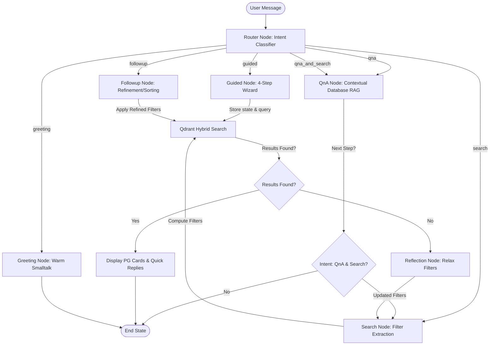

# StayEase AI — Ahmedabad PG Finder

StayEase AI is a full-stack, agentic AI chatbot designed to simplify the discovery of Paying Guest (PG) accommodations in Ahmedabad. Combining a **FastAPI backend** and a **React 18 frontend** with a **LangGraph multi-agent orchestration workflow**, it enables users to search for PGs via either a structured guided wizard or natural conversational queries. Powered by **Qdrant Cloud True Hybrid Search (Dense + Sparse)**, the system performs intelligent retrieval and features self-correcting reflection mechanisms to dynamically relax filters when zero results are found.

---

## 🚀 Key Features

* **Dual Search Interfaces**: Find accommodations by answering a quick, thumb-friendly 4-step wizard (Area, Gender, Budget, Rating) or using free-form natural language prompts.
* **True Hybrid Vector Search**: Combines semantic embeddings (`BAAI/bge-small-en-v1.5`) and keyword search (`Qdrant/bm25`) using native Reciprocal Rank Fusion (RRF) in Qdrant Cloud.
* **LangGraph Multi-Agent Orchestration**: Managed via `langgraph`, routing conversational state between router, smalltalk greeting, guided steps, free-form search extraction, Q&A, and self-reflection nodes.
* **Self-Correcting Reflection**: If a user's strict search filters yield empty results, a reflection agent evaluates the query and dynamically relaxes parameters (e.g., expanding boundaries, increasing budgets, or clearing food restrictions) to prevent dead ends.
* **Knowledge Retrieval (RAG)**: A context-aware Q&A node resolves generic questions about PG terms, deposit rules, co-living differences, or specific amenities using verified listings database context.
* **Premium User Interface**: Immersive frontend featuring custom mouse interactions, fluid page transitions, live typing preview simulations, skeleton loading states, and direct click-to-call/map action cards.

---

## 📊 System Architecture

The following state machine details how `pg_graph` handles state transitions for each conversation turn:



---

## 📁 Directory Structure

```text
AmdavadPG/
├── backend/
│   ├── main.py                   # FastAPI Application Entry (API endpoints + serves static build)
│   ├── agent.py                  # Graph prototype and fallback node logic
│   ├── qdrant_store.py           # Qdrant client initialization, schema definitions, and hybrid search methods
│   ├── seed_data.py              # Data loader script (normalizes and inserts local listings into Qdrant)
│   ├── requirements.txt          # Python application dependencies
│   ├── Dockerfile                # Backend containerization specifications
│   ├── .env                      # API keys & Database configuration parameters
│   ├── agents/                   # LangGraph Multi-Agent Workflows
│   │   ├── __init__.py
│   │   ├── graph.py              # Compiles nodes and defines conditional edges/state routing
│   │   ├── state.py              # AgentState TypedDict definition representing graph schema
│   │   ├── router.py             # Intent classifier node using Llama 3.3 70B
│   │   ├── greeting.py           # Warm-up Smalltalk node for incoming requests
│   │   ├── search.py             # Free-form search & filter extraction node
│   │   ├── guided.py             # 4-step wizard state machine tracking step responses in session
│   │   ├── followup.py           # Refinement, offset paging, and sorting node
│   │   ├── qna.py                # Contextual RAG Q&A node reading listings database context
│   │   └── reflection.py         # Self-correction filter relaxation node
│   └── static/                   # Output directory for served frontend React bundle
├── frontend/
│   ├── src/
│   │   ├── App.jsx               # Main React entry managing landing vs. chatbot transitions
│   │   ├── index.css             # Root styles, animation utilities, and Tailwind imports
│   │   ├── main.jsx              # DOM rendering mount point
│   │   ├── components/           # Reusable User Interface Components
│   │   │   ├── LandingPage.jsx   # Interactive landing page with tilt hover effects and stats counter
│   │   │   ├── ChatWindow.jsx    # Immersive chatbot window with typing placeholders & scroll anchors
│   │   │   ├── MessageBubble.jsx # Renders chat dialogue bubbles and horizontally scrolling PG lists
│   │   │   ├── PGCard.jsx        # Detail card showing pricing, sharing, reviews, amenities, and CTA actions
│   │   │   ├── QuickReplyButtons.jsx # Render clickable action buttons
│   │   │   └── TypingIndicator.jsx   # Animated loading bounce indicators
│   │   ├── hooks/
│   │   │   └── useChat.js        # React hook handling chat logs, loading, API requests, and reset state
│   │   └── utils/
│   │       └── api.js            # Axios configuration mapping endpoints
│   ├── index.html
│   ├── tailwind.config.js
│   ├── postcss.config.js
│   ├── vite.config.js
│   ├── Dockerfile                # Frontend Nginx production serving specifications
│   └── package.json
├── Dockerfile                    # Single-container production multi-stage build configuration
├── docker-compose.yml            # Multi-service development docker compose configuration
├── .gitignore
└── README.md                     # Project documentation (this file)
```

---

## ⚙️ Setup and Installation

### Environment Configuration

Create a `.env` file inside `backend/.env` with the following configuration details:

```env
# Groq LLM Provider Configuration
GROQ_API_KEY=your_groq_api_key_here

# Qdrant Vector Cloud Database Configurations
QDRANT_URL=your_qdrant_cloud_cluster_url
QDRANT_API_KEY=your_qdrant_cloud_api_key
QDRANT_COLLECTION=pg_listings
```

---

### Local Development Setup

#### 1. Backend Setup (FastAPI)
Navigate to the backend directory, configure a python virtual environment, install requirements, seed listing records, and launch the api:

```bash
cd backend
python -m venv .venv

# On Linux/macOS:
source .venv/bin/activate
# On Windows (Cmd):
.venv\Scripts\activate.bat
# On Windows (PowerShell):
.venv\Scripts\Activate.ps1

pip install -r requirements.txt

# Seed listing documents to Qdrant Cloud (dense + sparse indices)
python seed_data.py

# Launch development server (default port: 8000)
uvicorn main:app --reload
```

The API endpoints will be accessible at `http://localhost:8000`.

#### 2. Frontend Setup (React + Vite)
Open a new terminal, navigate to the frontend directory, install npm packages, and start the development server:

```bash
cd frontend
npm install
npm run dev
```

The UI application will be accessible at `http://localhost:5173`.

---

### Dockerized Orchestration (Compose)

We provide a `docker-compose.yml` file to spin up both frontend and backend services in matching containers with reverse-proxy support.

1. Configure `.env` in `backend/.env`.
2. Seed listings into Qdrant Cloud:
   ```bash
   docker compose --profile seed run --rm seed
   ```
3. Run the application containers:
   ```bash
   docker compose up --build
   ```
4. Access the web application at `http://localhost:3000`.

---

## 🔌 API Endpoints

### `GET /health`
Returns server status check.
* **Response**: `{"status": "ok", "agent": "langgraph"}`

### `POST /chat`
Accepts active chat context history and responds with LangGraph compiled agent outputs.
* **Headers**: `Content-Type: application/json`
* **Request Body**:
  ```json
  {
    "messages": [
      { "role": "user", "content": "PG near Memnagar under 10K for girls with food" }
    ],
    "message_source": "typed",
    "session_data": {},
    "pg_count": 0
  }
  ```
* **Response Body**:
  ```json
  {
    "mode": "results",
    "intent": "search",
    "message": "I found 3 PGs matching your requirements:",
    "quick_replies": [
      "Sort by Lowest Price",
      "Sort by Top Rated",
      "Change budget",
      "Different area"
    ],
    "pgs": [
      {
        "id": "1",
        "name": "Stanza Living Dublin House",
        "area": "Memnagar",
        "address": "Opp. Memnagar Fire Station, Ahmedabad",
        "gender": "Girls",
        "rating": 4.6,
        "single_price": 9500,
        "double_price": 7800,
        "food_included": true,
        "amenities": "AC, WiFi, Laundry, Gym"
      }
    ],
    "count": 1,
    "session_data": {
      "_last_filters": { ... }
    }
  }
  ```

---

## 📝 Notes

* **Data Seeding**: Seeding data via `seed_data.py` must be performed at least once before making first chat requests to populate the vector collection index in Qdrant.
* **Pre-baked Models**: Our docker container pipeline pre-installs fastembed sparse and dense models during image compilation, preventing server execution delays on container startup.
