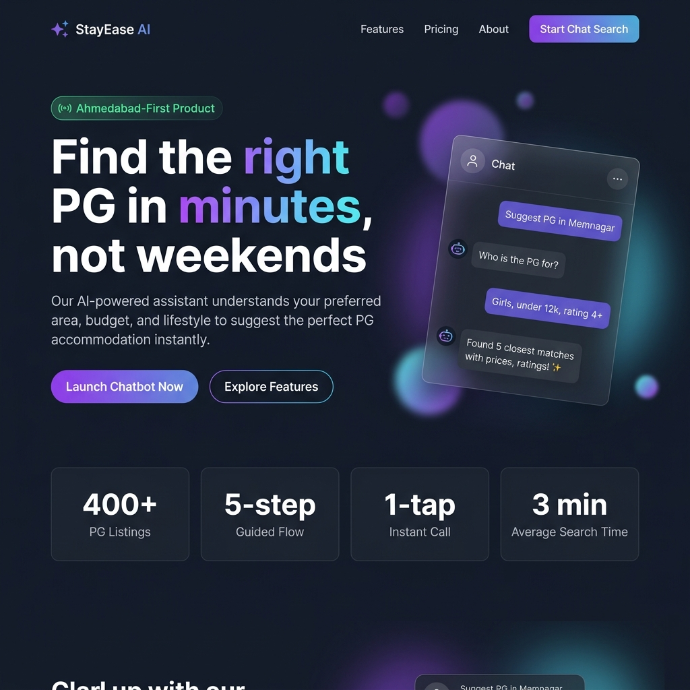
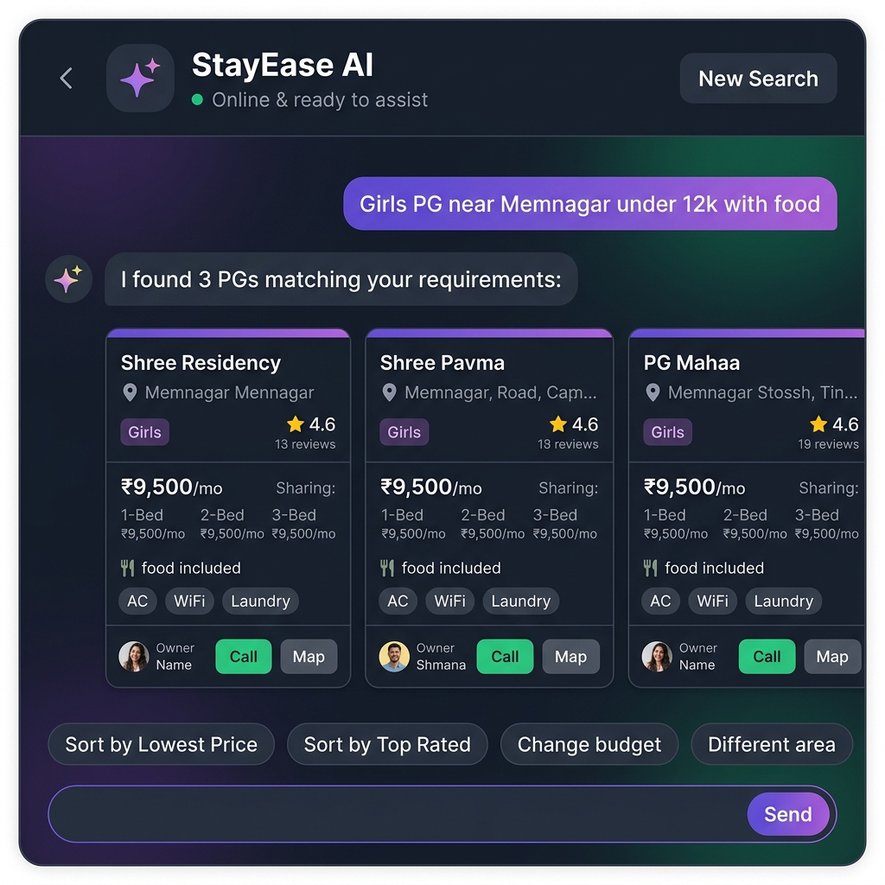

# StayEase AI — Find Your PG in Ahmedabad in Minutes, Not Weekends

> An AI-powered conversational platform that eliminates the chaos of PG hunting in Ahmedabad — just tell it what you need, and it finds the right match instantly.

---

## 📸 See It in Action

| **Landing Page** — Tell the AI what you need | **Chat Results** — Instant matches with one-tap actions |
| :---: | :---: |
|  |  |

> **Left:** The landing page introduces you to StayEase AI with a live chat preview — just click "Launch Chatbot Now" and start searching. **Right:** Type a natural query like *"Girls PG near Memnagar under ₹12k with food"* and get detailed PG cards with pricing, ratings, amenities, and direct call/map buttons — no browsing, no filtering, no frustration.

---

## 🛑 The Pain Points We're Solving

Every student or working professional moving to Ahmedabad faces the same nightmare:

### 1. 🔍 Information is Scattered Everywhere
PG listings live across dozens of outdated websites, WhatsApp groups, local broker networks, and handwritten notices on college boards. There is no single reliable place to search.

**How we solve it →** StayEase AI aggregates **400+ verified PG listings** across 8 key Ahmedabad areas into a single searchable database powered by hybrid AI search. One conversation replaces hours of browsing.

### 2. 🚫 Rigid Filters Lead to Empty Results
Traditional platforms make you fill checkboxes — area, budget, AC, food, WiFi. Pick too many and you get a devastating **"0 results found"** page. Pick too few and you drown in irrelevant listings.

**How we solve it →** Our **self-correcting AI** never shows you an empty screen. If your exact criteria yields zero matches, StayEase automatically relaxes non-critical filters (like expanding budget slightly or removing food preference) and shows you the **closest possible matches** instead. You always see options.

### 3. 📞 Endless Phone Calls Just to Learn Basic Details
To find out sharing prices, food availability, or deposit rules, you have to call owner after owner, repeating the same questions. Most don't pick up. Some give vague answers.

**How we solve it →** Every PG card shows **complete pricing breakdown** (single/double/triple sharing), food status, amenity list, owner name, and **one-tap call and Google Maps buttons**. You only call when you're ready to visit.

### 4. ⏰ The Whole Process Takes Days or Weeks
Between browsing, calling, visiting, and comparing — finding a decent PG typically consumes **2–3 full weekends**. For someone who just got an offer letter or college admission, that's time they don't have.

**How we solve it →** Average search-to-shortlist time on StayEase AI is **under 3 minutes**. Tell the chatbot your preferences in plain language, get matched results instantly, and call the owner directly from the card.

---

## 💬 How It Actually Works for You

### Scenario 1: You Know What You Want
> *"Show me boys PG near Vastrapur under ₹10,000 with WiFi"*

The AI extracts your area, budget, gender preference, and amenity requirement — then instantly queries the database and shows you matching PG cards with prices, ratings, and call buttons.

### Scenario 2: You're New to Ahmedabad and Unsure
> *"Help me find a PG"*

The assistant launches a friendly **4-step guided wizard**:
1. **Which area?** → Shows 8 popular areas as quick-tap buttons
2. **Boys or Girls?** → One tap
3. **Budget range?** → Preset options like "Under ₹8,000" or "₹12,000–₹15,000"
4. **Minimum rating?** → 4.5⭐, 4.0⭐, or any

After 4 taps, you get a curated shortlist — no typing required.

### Scenario 3: You Want to Refine Results
> *"Show me cheaper options"* or *"Sort by top rated"*

Already saw results but want to adjust? The AI remembers your context and instantly re-sorts or re-filters without starting over.

### Scenario 4: You Have Questions First
> *"What's a typical deposit in Ahmedabad?"* or *"What's the difference between PG and hostel?"*

The Q&A agent answers your question using verified listing data, then gently nudges you to start searching.

---

## 🎁 What You Get

| Pain Point | Traditional Way | With StayEase AI |
| --- | --- | --- |
| **Finding listings** | Browse 5+ websites, check WhatsApp groups | One conversation covers 400+ listings |
| **Getting details** | Call 10+ owners, repeat yourself | Complete info on every card — pricing, food, amenities |
| **Strict filter failures** | "0 results found" | AI relaxes filters, always shows closest matches |
| **Contacting owners** | Copy number, open dialer, call | One-tap call button on every card |
| **Finding on map** | Search address manually | One-tap Google Maps link |
| **Time spent** | 2–3 weekends | Under 3 minutes |

---

## 🏘️ Areas Covered

Memnagar · Navrangpura · Prahlad Nagar · Satellite · Shivranjani · Thaltej · Vastrapur · Vijay Crossroads

*More areas are being added continuously.*
